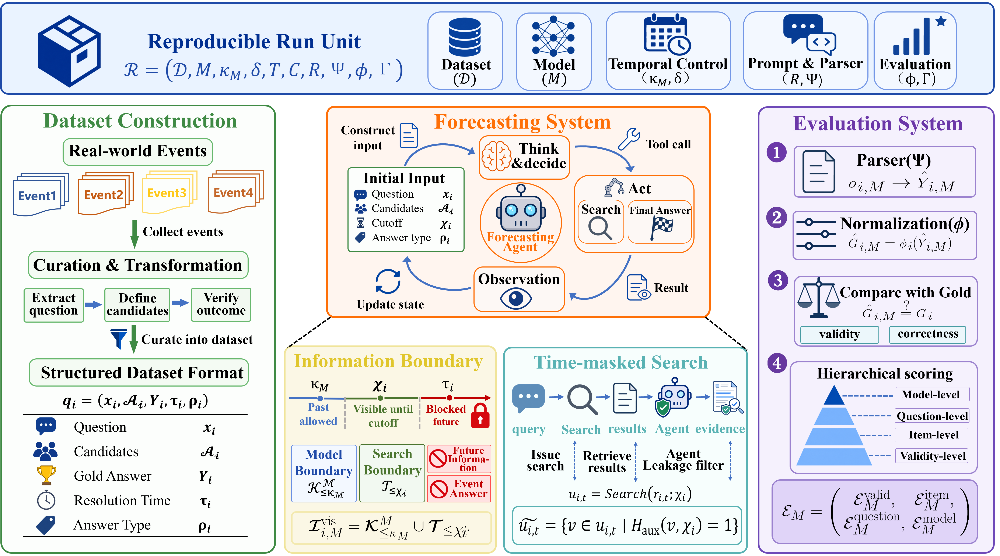

<div align="center">


<em>通过知识截止与时间掩码，对 LLM 原生预测能力进行基准评测的可复现框架</em>

[](https://github.com/MaYiding/OracleProto/stargazers)
[](https://github.com/MaYiding/OracleProto/network)
[](https://github.com/MaYiding/OracleProto/issues)
[](https://github.com/MaYiding/OracleProto/pulls)


[English](./README.md) | [中文文档](./README-ZH.md) | [Hugging Face](https://huggingface.co/datasets/MaYiding/OracleProto) | 论文

访问我们的排行榜：[oracleproto.pages.dev](https://oracleproto.pages.dev)

</div>

---

## 概述

随着大语言模型（LLM）向现实世界的决策支持系统演进，评估其“原生预测能力”面临着一个根本性矛盾：实时基准能完美避免数据污染但事件结束后即刻失效，而回顾性基准虽可复现，却极易将预训练记忆误判为真正的预测。为了解决这一挑战，我们提出了 OracleProto，一个针对 LLM 原生预测能力的可复现评估框架。该框架通过联合执行模型知识截止期对齐、工具级时间掩蔽、内容级泄露检测，以及标准化的层级评分机制，将已完结事件完美重构为具有严格时间边界的预测样本。基于六款主流大模型的评估表明，OracleProto 能够在受控信息边界下精准区分模型的预测质量、稳定性与成本效率，并将残余泄露率降至 1% 的数量级。OracleProto 将一次性的预测评估转化为可审计、可复用且支持后续监督微调（SFT）与强化学习（RL）的数据集级能力。

<div align="center">



OracleProto 框架图

</div>

---

## 1. 代码结构

```
forecast_eval/                       # 核心代码
├─ runner.py                         # build_task_plan + 调度
├─ react.py                          # ReAct 循环 + Tavily end_date 注入
├─ leak_filter.py                    # 检索内容审计
├─ llm.py                            # OpenAI 兼容客户端；强制禁止供应商原生浏览
├─ search.py                         # Tavily 包装
├─ analysis/                         # 评分与诊断：accuracy、FSS、BI、composite、behavior
├─ prompts.py / parser.py            # 输入渲染器 R / 输出解析器 Ψ
├─ types.py / errors.py / config.py  # 数据模型 / 类型化异常 / Settings
├─ db.py / loader.py                 # SQLite schema 迁移 / 数据集同步
└─ tavily_keys.py / tools.py         # API key 轮转 / 工具 schema
evaluation.py                        # 入口
scripts/                             # 离线工具
tests/                               # 测试
runs/, logs/                         # 运行产物
forecast_eval_set_example.db         # 样例数据集
```

---

## 2. 快速开始

### 2.1 环境

```bash
conda env create -f environment.yml
conda activate oracleproto
```

### 2.2 配置 `.env`

```bash
cp .env.example .env
```

填入 `LLM_API_KEY`、`LLM_BASE_URL`、`MODELS`、`MODEL_TRAINING_CUTOFFS`、`TAVILY_API_KEY`、`LEAK_DETECTOR_API_KEY`、`LEAK_DETECTOR_BASE_URL`、`LEAK_DETECTOR_MODEL`。其他解释说明见 [`.env.example`](./.env.example) 中的注释。

### 2.3 测试

```bash
pytest tests/ -q
```

### 2.4 运行

```bash
python evaluation.py
```

每次调用创建 `runs/{run_id}/`，`run_id` 形如 `YYYYMMDD-HHMMSS-{4-char hex}`。
在 `.env` 中设置 `RUN_ID=<existing-id>` 即可在同一目录中续跑该运行；已完成的题目或不符合条件的题目将被跳过，瞬时错误按原退避策略重试。

---

## 3. 接入自有数据集

仓库随附 `forecast_eval_set_example.db`，包含 80 道人工精选的问题，覆盖三种题型，日期跨越 2026-03-12 至 2026-04-14。若要接入其他语料，仅需替换 `.env` 中的 `SOURCE_DB` 与 `SOURCE_TABLE`。

---

## 4. 输出

```
runs/{run_id}/
├─ manifest.json          # 运行级元数据与哈希链
├─ db/{model_slug}.db     # 每模型一份 SQLite，可独立重放
├─ analysis/              # 由原始 DB 重算的 CSV/JSON
└─ logs/{run_id}.log
```

DB 仅存原始观测。每一项聚合（$`\text{pass@1}`$、FSS、BI、composite 等）由 `forecast_eval/analysis/` 重算，该步骤在 `evaluation.py` 末尾自动运行，亦可独立调用：

```bash
python -m forecast_eval.analysis runs/{run_id}
```

---