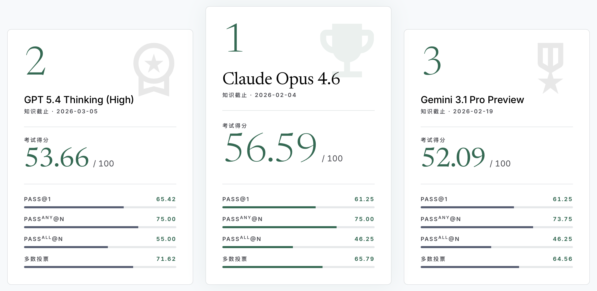

<div align="center">


<em>通过知识截止与时间掩码，对 LLM 原生预测能力进行基准评测的可复现框架</em>

$$\text{预测} = \text{信息搜集} \times \text{证据整合} \times \text{情势研判} \times \text{行动决策}$$

传统基准考的是“你记得住答案吗”
<br>
OracleProto 问的是“你能预测未来吗”

<b>愿每一次预测都可复现，愿 AI 真正走向辅助决策</b>
<br>
服务于每一个人对美好生活的判断与选择


[English](./README.md) | [中文文档](./README-ZH.md) | [Hugging Face](https://huggingface.co/datasets/MaYiding/OracleProto)

查看我们的论文：[arXiv](http://arxiv.org/abs/2605.03762)

访问我们的排行榜：[oracleproto.pages.dev](https://oracleproto.pages.dev)

</div>

---

## 概述

- **背景与挑战：** LLM预测评估面临两难：实时测试**易失效**，回顾测试存在**数据泄露**。提示词无法建立真实的**知识边界**。

- **架构和方法：** OracleProto 框架结合模型知识截止与时间遮蔽，将历史事件严谨重构为**具有时间边界的可复现的预测样本**。

- **实验的效果：** 测试6种主流LLM 表明，OracleProto能有效区分了模型的预测质量、稳定性与成本效益，将泄露率降至1%，为**模型对比、监督微调和强化学习**提供了受控的信号源。

<div align="center">


OracleProto 框架图



OracleProto 在线排行榜速览

</div>

---
## 1. 代码结构

```
forecast_eval/                       # 核心代码
├─ runner.py                         # build_task_plan + 调度
├─ react.py                          # ReAct 循环 + Tavily end_date 注入
├─ leak_filter.py                    # 检索内容审计
├─ llm.py                            # OpenAI 兼容客户端；强制禁止供应商原生浏览
├─ search.py                         # Tavily 包装
├─ analysis/                         # 评分与诊断：accuracy、FSS、BI、composite、behavior
├─ prompts.py / parser.py            # 输入渲染器 R / 输出解析器 Ψ
├─ types.py / errors.py / config.py  # 数据模型 / 类型化异常 / Settings
├─ db.py / loader.py                 # SQLite schema 迁移 / 数据集同步
└─ tavily_keys.py / tools.py         # API key 轮转 / 工具 schema
evaluation.py                        # 入口
scripts/                             # 离线工具
tests/                               # 测试
runs/, logs/                         # 运行产物
forecast_eval_set_example.db         # 样例数据集
```

---

## 2. 快速开始

### 2.1 环境

使用 `uv` ：

```bash
uv sync
source .venv/bin/activate
```

或使用 `Conda`：

```bash
conda env create -f environment.yml
conda activate oracleproto
```

### 2.2 配置 `.env`

```bash
cp .env.example .env
```

填入 `LLM_API_KEY`、`LLM_BASE_URL`、`MODELS`、`MODEL_TRAINING_CUTOFFS`、`TAVILY_API_KEY`、`LEAK_DETECTOR_API_KEY`、`LEAK_DETECTOR_BASE_URL`、`LEAK_DETECTOR_MODEL`。其他解释说明见 [`.env.example`](./.env.example) 中的注释。

### 2.3 测试

```bash
pytest tests/ -q
```

### 2.4 运行

```bash
python evaluation.py
```

每次调用创建 `runs/{run_id}/`，`run_id` 形如 `YYYYMMDD-HHMMSS-{4-char hex}`。
在 `.env` 中设置 `RUN_ID=<existing-id>` 即可在同一目录中续跑该运行；已完成的题目或不符合条件的题目将被跳过，瞬时错误按原退避策略重试。

---

## 3. 接入自有数据集

仓库随附 `forecast_eval_set_example.db`，包含 80 道人工精选的问题，覆盖三种题型，日期跨越 2026-03-12 至 2026-04-14。若要接入其他语料，仅需替换 `.env` 中的 `SOURCE_DB` 与 `SOURCE_TABLE`。

---

## 4. 输出

```
runs/{run_id}/
├─ manifest.json          # 运行级元数据与哈希链
├─ db/{model_slug}.db     # 每模型一份 SQLite，可独立重放
├─ analysis/              # 由原始 DB 重算的 CSV/JSON
└─ logs/{run_id}.log
```

DB 仅存原始观测。每一项聚合（$`\text{pass@1}`$、FSS、BI、composite 等）由 `forecast_eval/analysis/` 重算，该步骤在 `evaluation.py` 末尾自动运行，亦可独立调用：

```bash
python -m forecast_eval.analysis runs/{run_id}
```

---

## 5. 联系与合作

如有代码使用、数据集构建、复现问题等，欢迎直接联系项目开发者：
- **马一丁**：[yidingma@bupt.edu.cn](mailto:yidingma@bupt.edu.cn)
- **阮承沄**：[ruanchengyun815@bupt.edu.cn](mailto:ruanchengyun815@bupt.edu.cn)

如需联合研究、数据与评测基准共建、论文合作等，请联系课题负责人：
- **黄凯博**（通讯作者）：[huangkaibo@bupt.edu.cn](mailto:huangkaibo@bupt.edu.cn)
- **杨忠良**（通讯作者）：[yangzl@bupt.edu.cn](mailto:yangzl@bupt.edu.cn)

---

## 6. 论文

查看我们的论文：[arXiv](http://arxiv.org/abs/2605.03762)

---
## 7. 引用

如果您在研究中使用了本项目，请引用我们的论文：

```
@article{OracleProto,
  title={OracleProto: A Reproducible Framework for Benchmarking LLM Native Forecasting via Knowledge Cutoff and Temporal Masking},
  author={Yiding Ma, Chengyun Ruan, Kaibo Huang, Zhongliang Yang, Linna Zhou},
  journal={arXiv preprint arXiv:2605.03762},
  year={2026}
}
```

---